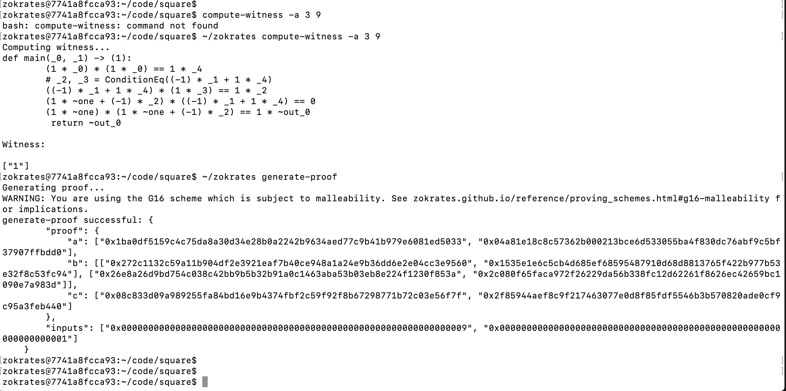
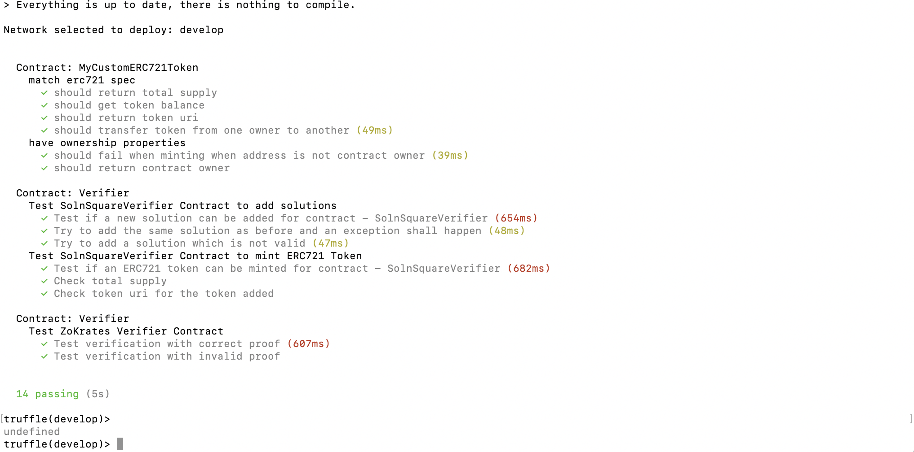
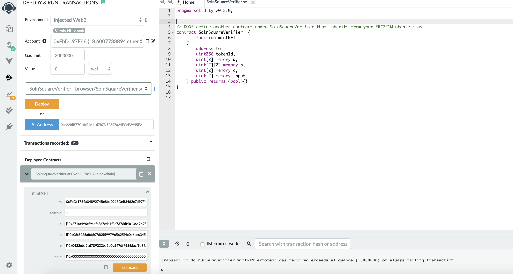
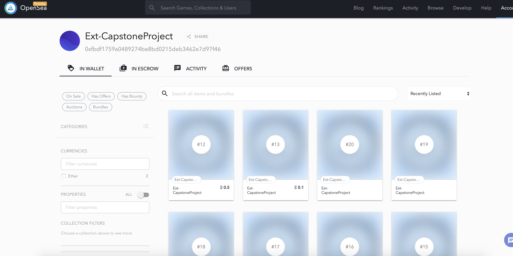

# Udacity Blockchain Capstone

This is a demonstration project about representing real estate as a non-fungible tokens and managing them in a decentralised fashion on the Ethereum blockchain.

The ERC721 standard is used to represent each property as a token. Properties can be minted, assigned metadata that lives off-chain and subsequently traded on an online marketplace.

For added security, minting of new properties is only allowed once verification is provided that a property belongs to the owner. This is achieved with a zero-knowledge proof, with the owner demonstrating to 3rd parties that they have the title to a property without revealing any information about the property itself. Specifically, the zk-snark methodology is implemented using Zokrates.

## Project Steps

* Clone the project repository
* Explore the code base.
* Fill out ERC721 Mintable Contract in ERC721Mintable.sol
* Write test cases TestERC721Mintable.js
* Compile and pass test cases in TestERC721Mintable.js
* Implement Zokrates
* Write a test script to verify the solidity contract generated by Zokrates executed successfully - TestSquareVerifier.js
* Write test contract for ZK and ERC721 integration - SolnSquareVerifier.sol
* Compile and pass with TestSolnSquareVerifier.js
* Deploy latest contracts generated by Zokrates (a.k.a verifier.sol)
* Deploy SolnSquareVerifier contract to Rinkeby network
* Mint 10 tokens
* Generate OpenSea marketplace
* Test and Verify OpenSea with your SolnSquareVerifier tokens
* List 5 of your tokens on the marketplace
* Purchase those 5 tokens using a different address
* Complete required documentation and submit!

## Installation and Setup

This repository contains:
 * Smart Contract code in Solidity (using Truffle), 
 * Tests (also using Truffle), 
 * zk-snarks implementation (using Zokrates)

### Contract Deployment

To deploy contracts, download or clone the repo, then:

`npm install`
`cd eth-contracts && truffle compile`
`cd eth-contracts && truffle migrate`

An infura account is required and the appropriate secret and mnemonic need to be stored appropriately (used in th truffle-config.js)

To deploy to the Rinkeby test network
`cd eth-contracts && truffle migrate --network rinkeby`

```bash
Bilals-MacBook-Pro-2:eth-contracts bilalcagiran$ truffle migrate --network rinkeby

Compiling your contracts...
===========================
> Everything is up to date, there is nothing to compile.


Migrations dry-run (simulation)
===============================
> Network name:    'rinkeby-fork'
> Network id:      4
> Block gas limit: 0x989680


1_initial_migration.js
======================

   Deploying 'Migrations'
   ----------------------
   > block number:        6306011
   > block timestamp:     1586745412
   > account:             0xFbDf1759a0489274Be8bd0215DeB3462e7d97F46
   > balance:             18.674885707
   > gas used:            153274
   > gas price:           2 gwei
   > value sent:          0 ETH
   > total cost:          0.000306548 ETH

   -------------------------------------
   > Total cost:         0.000306548 ETH


2_deploy_contracts.js
=====================
Network selected to deploy: rinkeby-fork
   -------------------------------------
   > Total cost:                   0 ETH


Summary
=======
> Total deployments:   1
> Final cost:          0.000306548 ETH


Starting migrations...
======================
> Network name:    'rinkeby'
> Network id:      4
> Block gas limit: 0x989680


1_initial_migration.js
======================

   Deploying 'Migrations'
   ----------------------
   > transaction hash:    0xe585979c9bd21abe3d12fef57f2feedfd4e263f4610995b489e7178f8c3aacf9
   > Blocks: 0            Seconds: 12
   > contract address:    0xE8aDBdB8951dCCC879C5Ee87889078B08Ee8363b
   > block number:        6306012
   > block timestamp:     1586745436
   > account:             0xFbDf1759a0489274Be8bd0215DeB3462e7d97F46
   > balance:             18.671826775
   > gas used:            168274
   > gas price:           20 gwei
   > value sent:          0 ETH
   > total cost:          0.00336548 ETH


   > Saving migration to chain.
   > Saving artifacts
   -------------------------------------
   > Total cost:          0.00336548 ETH


2_deploy_contracts.js
=====================
Network selected to deploy: rinkeby

   Deploying 'Verifier'
   --------------------
   > transaction hash:    0x004d5c6f8a03721d091b645e251ead63e2de6716ba411b87490bbd5c7c74de3e
   > Blocks: 0            Seconds: 8
   > contract address:    0x50FafE80bC86c38dB939C1Ea77fad7479315e132
   > block number:        6306014
   > block timestamp:     1586745466
   > account:             0xFbDf1759a0489274Be8bd0215DeB3462e7d97F46
   > balance:             18.654504575
   > gas used:            823831
   > gas price:           20 gwei
   > value sent:          0 ETH
   > total cost:          0.01647662 ETH


   Deploying 'SolnSquareVerifier'
   ------------------------------
   > transaction hash:    0xf1fc5d2a56d9ecc626487f7e44d57fb5b2c928a6265c960882e19b48edb416e2
   > Blocks: 0            Seconds: 8
   > contract address:    0xc22fdB77CedfE4e11d7b7D52897a24ECeE2945E2
   > block number:        6306015
   > block timestamp:     1586745481
   > account:             0xFbDf1759a0489274Be8bd0215DeB3462e7d97F46
   > balance:             18.607748135
   > gas used:            2337822
   > gas price:           20 gwei
   > value sent:          0 ETH
   > total cost:          0.04675644 ETH


   > Saving migration to chain.
   > Saving artifacts
   -------------------------------------
   > Total cost:          0.06323306 ETH


Summary
=======
> Total deployments:   3
> Final cost:          0.06659854 ETH 

```

### ZK-SNARKS

ZoKrates is a toolbox for zkSNARKs on Ethereum. The following steps were used to generate zero knowledge proofs and a verifier contract.

* Run ZoKrates docker container (from within zokrates directory):

`
docker run -v $PWD/code:/home/zokrates/code -ti zokrates/zokrates /bin/bash
`

* Generate proofs (small script to generate 10 proofs)

` ~/zokrates ./generateProofs.sh`

* Export Verifier smart contract

`~/zokrates export-verifier`



### Contract Testing

```bash
npm run test
```

 
 
## Minting Tokens

An easy way to mint tokens is to create an interface with the deployed token on Remix, specifying the functions to be used. Once compiled, the contract address of the deployed token can be entered, enabling interaction.
The proveMint function requires the input of a solution created through Zokrates and can only be used once. 

 

## Marketplace

The minted tokens can be listed for sale by creating a storefront on the OpenSea marketplace.

The storefront can be found here: https://rinkeby.opensea.io/assets?query=Ext-Caps

 


## Additional info

Contract Address

```bash
0xc22fdb77cedfe4e11d7b7d52897a24ecee2945e2
```

https://rinkeby.etherscan.io/address/0xc22fdb77cedfe4e11d7b7d52897a24ecee2945e2


# Project Resources

* [Remix - Solidity IDE](https://remix.ethereum.org/)
* [Visual Studio Code](https://code.visualstudio.com/)
* [Truffle Framework](https://truffleframework.com/)
* [Ganache - One Click Blockchain](https://truffleframework.com/ganache)
* [Open Zeppelin ](https://openzeppelin.org/)
* [Interactive zero knowledge 3-colorability demonstration](http://web.mit.edu/~ezyang/Public/graph/svg.html)
* [Docker](https://docs.docker.com/install/)
* [ZoKrates](https://github.com/Zokrates/ZoKrates)
